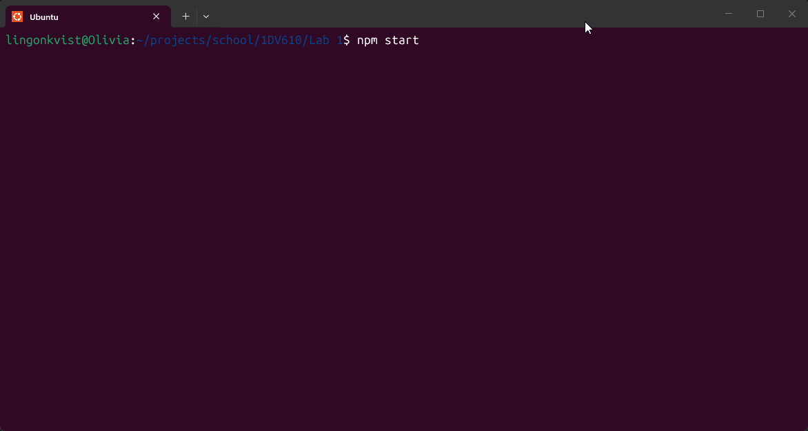

# deathroll-cli

A small CLI deathroll game against an NPC. School assignment for
"Introduction to Software Quality" (1DV610) at Linnaeus University.

You're on a five-minute raid break in Molten Core. A dwarf named
Bran Ironbrew walks up, introduces himself, and challenges you to a
deathroll for a thousand gold.

## Run it

Requires Node.js 24 or later.

```bash
npm install
npm start
```

## Built with

- TypeScript
- `chalk` for WoW-style chat colors
- Node built-ins (no other dependencies)

## Screenshot


